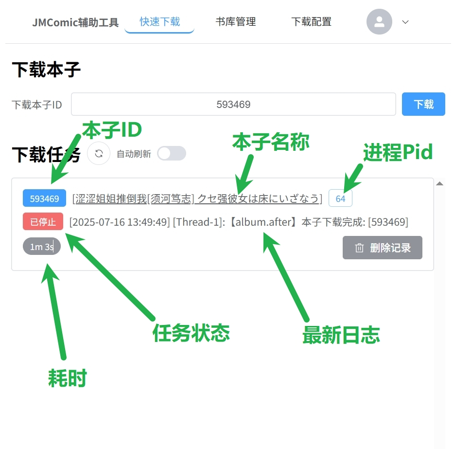
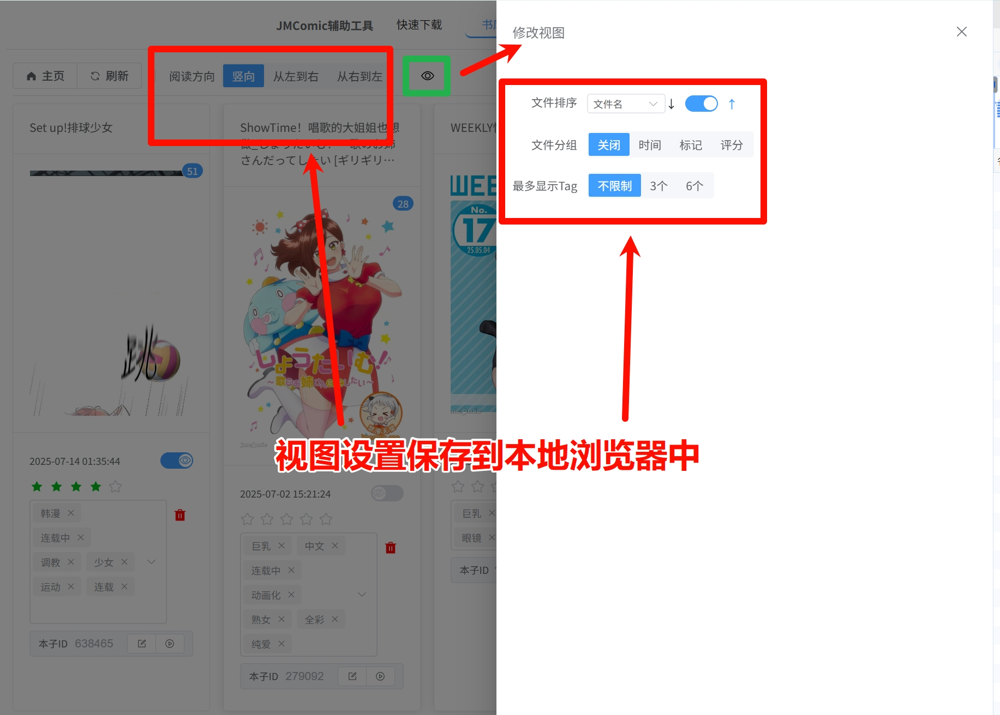
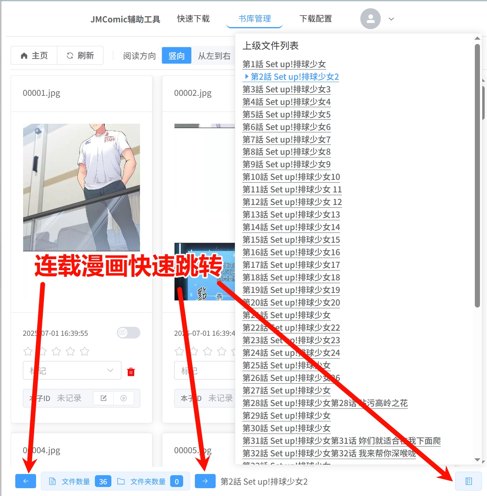
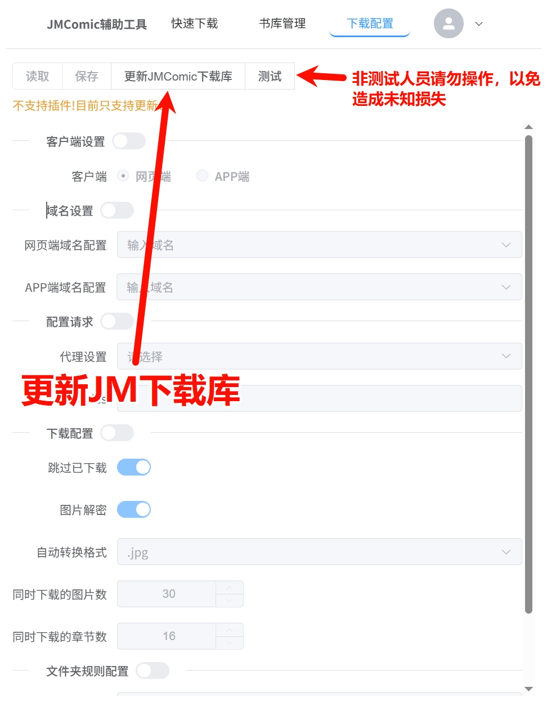
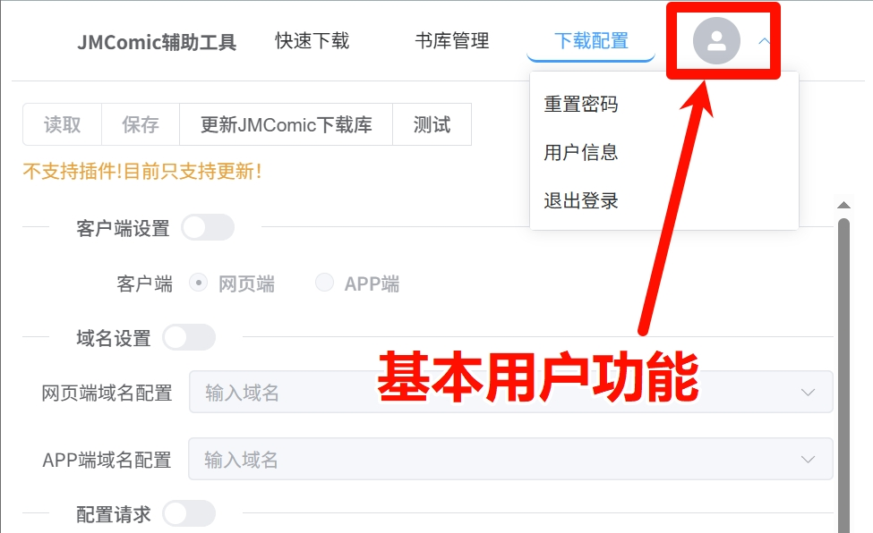
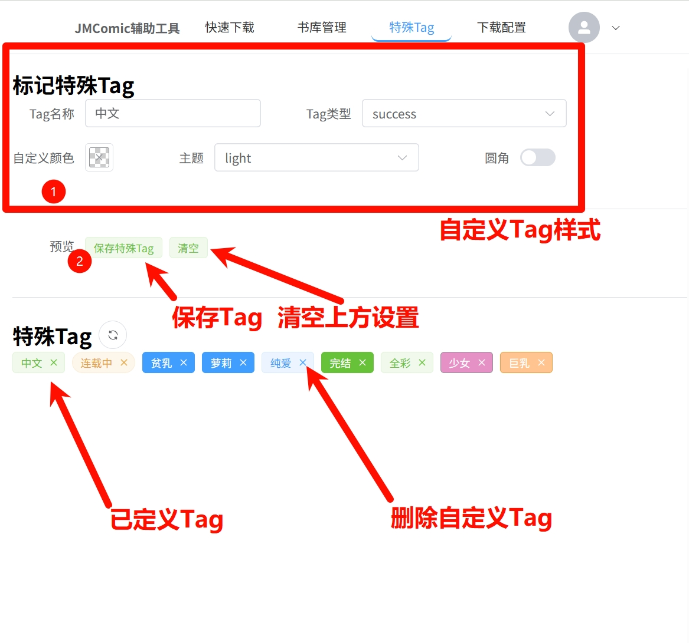

# 这个是一个Web漫画管理器

它依赖Sqlite工作，能将指定目录设置为漫画仓库，为其提供简单的标记、预览功能。

搭配Python环境，可以使用 [JMComic-Crawler-Pytho](https://github.com/hect0x7/JMComic-Crawler-Python) 这个库实现一键下载、下载完成后自然标记等功能。

项目前端基于 `Vue` 实现，后端采用 `Quarkus` 实现，源代码后续再补上

目前已实现功能
1. [x] 漫画预览（竖向、横向）
2. [x] 文件标记(多Tag、已读、评分、albumID等)
2. [x] 一键下载本子
3. [x] 一键更新 JMComic 库
4. [ ] ~~在线修改JMComic配置~~
5. [x] 移动端支持
6. [x] 简易分组展示
7. [x] 简易权限管理
8. [ ] 文件过滤展示
9. [x] 收藏夹(快速跳转)
10. [x] 高亮特殊Tag

---

## 预览
### 下载界面

```
注：
如果 下载进程日志 出现乱码，会影响自动标记本子id、tag等信息的自动标记
日志编码默认为UTF-8，Window下运行请改用外挂配置文件的方式运行来解决日志乱码问题
偶尔一两行出现乱码为程序BUG。
如果下载任务停止后，最后一条日志不是显示 【album.after】本子下载完成 有可能为中途异常退出，建议重新下载一次

下载调用的命令是:  jmcomic 本子ID --option="./option.yml"
```

### 书库管理


#### 快速跳转

#### 竖向预览界面

#### 横向预览界面


### 下载配置管理

```
注：目前这个界面只能用来更新 JMComic 库，以防止下载功能失效，其他功能未实现。
短期内，可能不会实现这块，需要自定义配置的，请手工修改程序目录下的 option.yml 文件

更新调用的命令是:  pip install jmcomic -i https://pypi.org/project -U
```

### 基本用户信息

```
用户名为 root
第一次运行会自动创建该用户，默认密码会打印到控制台中，根据控制台日志登录成功后，可以自己修改密码
```
### 标记特殊Tag

---

## 部署

目前项目仅支持一个主目录（默认为`./Archive`），建议使用Docker部署，可以映射别的目录进`./Archive`

当前管理规则下，不建议改变默认层次结构，以免路径混乱

环境需要：
  - Python
  - pip
  - jmcomic

部署方式分两种：
1. 静态编译（提供 `Window 64` 和 `amd64` 可执行文件）
   1. 下载静态可执行文件
   2. 配置Python环境(包括`pip`、`jmcomic`) 或者 自行编译Docker环境（Python）
   3. 运行主程序
```
Quarkus 的静态编译可能存在奇怪的报错，如遇到可以反馈
```
2. 自行部署`Java(JDK-21)`环境（如果你机器未提供静态编译程序，则只能使用这个方式部署）
   1. 下载Jar压缩包，解压后有Jar文件和lib文件夹
   2. 配置Python环境(包括`pip`、`jmcomic`) 或者 自行编译Docker环境（Python、JVM）
   3. 运行主程序（`java -jar xxxx.jar`）

---
Window下，下载本子本子日志乱码，请创建`application.properties`文件，内容如下
```
# 控制台程序吗默认编码
console.encoded=GBK
```
运行时使用`app.exe -Dquarkus.config.locations=./application.properties`该命令

Window也可使用conda、uv或者裸环境直接部署Python，无需Docker

附：[完整配置文件参考](application.properties)

---
Linux 下，提供两种方式的[Docker Build](Docker)文件，可以自行编译所需的Docker镜像